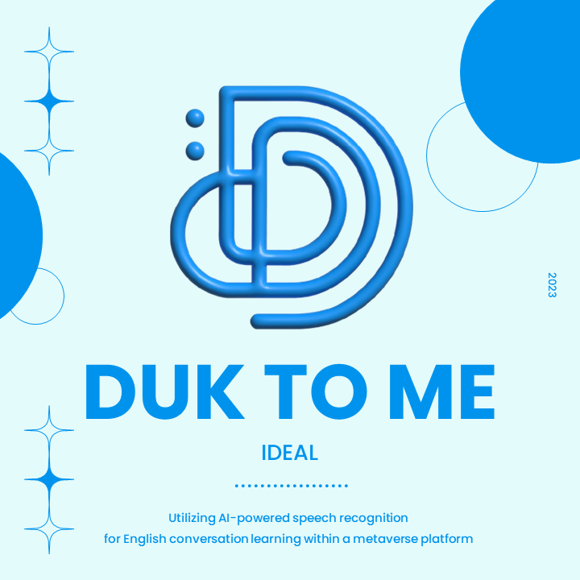
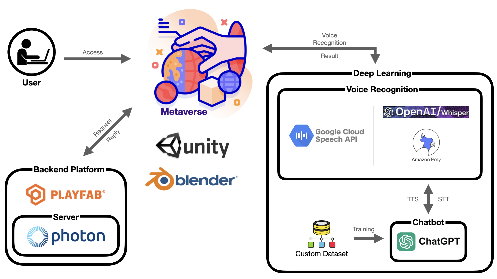
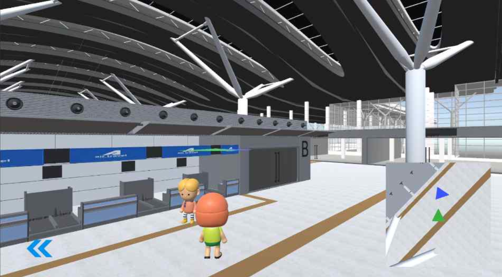
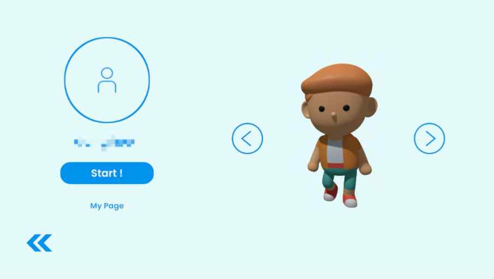
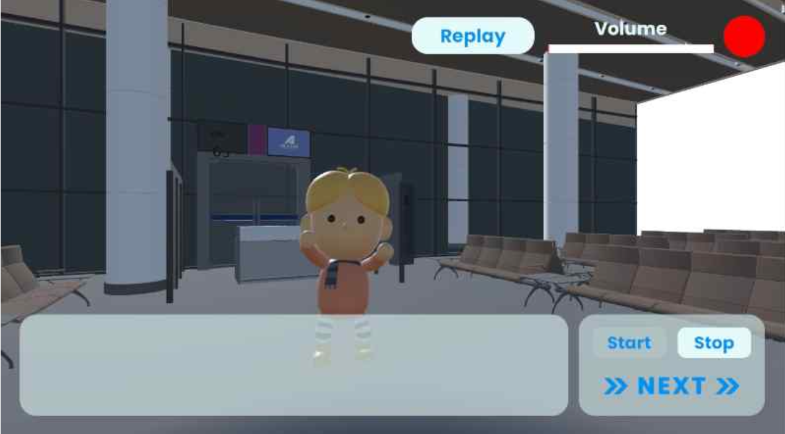
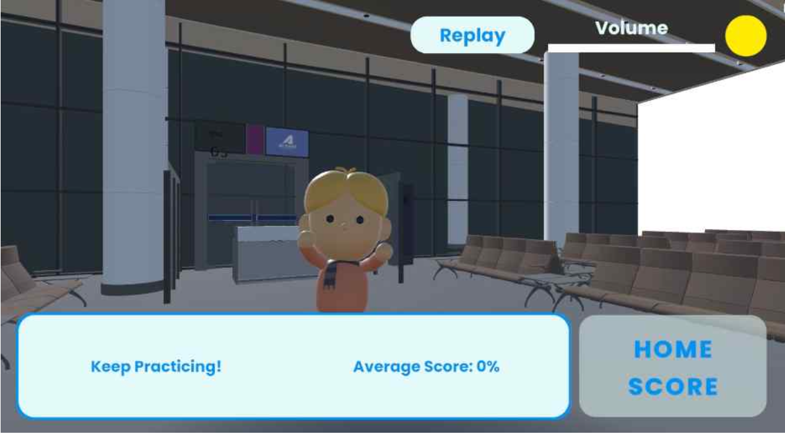

# 📁 Duk to Me - AI English Conversation Tutor in a Metaverse

> This project was originally developed as a team capstone project for the 2023 Evewa ICT Contest, and curated by Naomi Woo as an individual portfolio.

 

  

 

##  1. Project Overview
**Duk to Me** is an AI-powered English conversation platform built in a metaverse setting.  It offers immersive, low-pressure speaking practice through gamified real-world scenarios, using voice recognition to provide real-time feedback.  Designed to overcome the limitations of traditional language learning — like cost, anxiety, and accessibility — Duk to Me makes conversation training fun, flexible, and future-forward.

 

##  2. Motivation & Goals
Traditional English education in Korea — and many other countries — remains heavily focused on grammar and standardized testing. While this may help with reading or test-taking, it often fails to improve actual speaking ability, leaving learners underprepared for real-world communication.

As demand grows for practical conversation skills, especially among those pursuing global careers or preparing for English certifications, there is a clear need for more immersive, speaking-focused learning tools. Our team recognized this gap from personal experience and set out to design a platform that breaks free from rigid curriculums and passive study methods.

By leveraging cutting-edge technologies like AI voice recognition and metaverse environments, we aimed to create a gamified experience that makes learning enjoyable, engaging, and context-rich. The goal was to develop a tool that motivates learners, reinforces retention through interaction, and brings language practice into a more natural, culturally immersive setting — one where users can speak, listen, and respond just like they would in real life.

 

##  3. Key Features
🗺️ **Explore a Metaverse Airport Map**  
Navigate a fully interactive 3D airport world where learners can move their character freely. A mini-map helps visualize your current location and enhances spatial awareness during exploration.

🎤 **Real-Time Voice Interaction with AI**  
Engage in live English conversations powered by voice recognition and chatbot AI. The system uses Google Speech API, Whisper, and AWS Polly to process and respond to speech in real-time, simulating authentic conversation flow.

💬 **Multiple Learning Modes**  
Choose between Story Mode for guided role-play scenarios, or Free Conversation Mode for open dialogue with AI NPCs based on real-life airport situations.

🧍 **Customizable Characters**  
Select from a set of 8 unique avatars to represent you in the metaverse. Your character choice carries through the learning experience, adding a personal and engaging touch.

🧠 **Smart Feedback & Scoring System**  
After each conversation, receive immediate feedback on pronunciation and sentence accuracy. The system compares your responses with preset scripts and provides a score with encouraging feedback to help track your progress.

 

##  4. Architecture & Tech Stack

### 📐 System Architecture
Below is the overall architecture diagram illustrating the main functional components and their interactions within the Duk to Me platform.

  

 

### 🛠️ Tech Stack

| Category                     | Tools & Technologies                               |
|------------------------------|-----------------------------------------------------|
| 🎮 **Frontend / Game Engine** | Unity 2022, Blender 3.6                             |
| 🗄️ **Backend / Platform**      | PlayFab, Photon Server                              |
| 🧠 **AI / Voice Processing**  | Google Speech API, OpenAI Whisper, AWS Polly       |
| 💻 **Languages**              | C#, Python                                          |
| 🧰 **Development Tools**      | VS Code, PyCharm, Git                               |
| 🤝 **Collaboration**          | Trello, Discord                                     |

 

##  5. Screenshots and Demo

> Below are key screenshots showcasing the main features of *Duk to Me*.

 

### 🗺️ Metaverse Exploration

  

### 🧍 Character Selection

  

### 🎤 Real-Time AI Conversation

  

### 🧠 Feedback & Scoring System

  

 

### 📽️ Final Demo Video

> Watch a full demonstration of all core features — from character selection and voice interaction to real-time feedback — in action:

[▶️ Click here to watch the final demo on YouTube](https://youtu.be/7gwBMMFnIlQ)

 

## 👤 Author & Contact
**Team:** IDEAL (Evewa ICT Mentoring Project Team)  
**Project Contributor & Documentation Author:** Naomi Woo    
**GitHub:** [github.com/naomi-woo/Duk-to-Me](https://github.com/naomi-woo/Duk-to-Me)  
**Contact:** Feel free to reach out via [LinkedIn](https://www.linkedin.com/in/ju-woo-b77b91201/)
